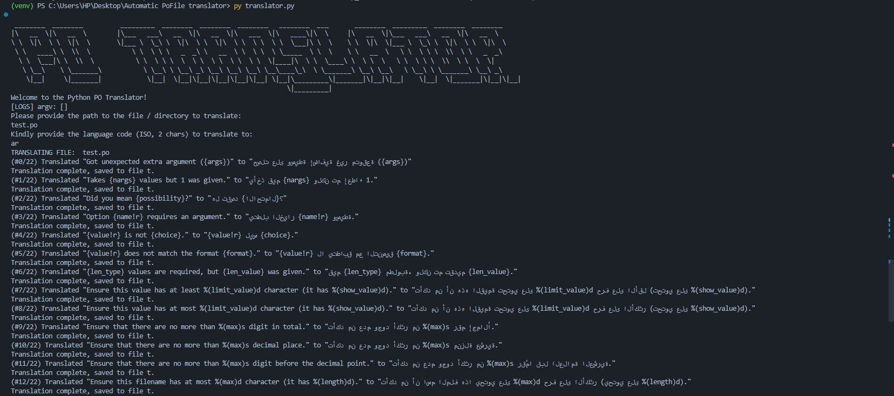

# Automatic PoFile Translator

## Overview

Automatic PoFile Translator is a simple script designed to assist in the automatic translation of `.po` files, which are commonly used in Django frameworks. This tool utilizes the Google Translator engine through the `deep_translator` module to provide seamless translations.

## Getting Started

### Clone the Repository

To get started, clone the repository to your local machine:

```sh
git clone https://github.com/osam7a/Automatic-PoFile-Translator.git .
```

### Install Required Modules

Navigate to the project directory and install the necessary modules using `pip`:

```sh
python3 -m pip install -r requirements.txt
```

## Usage

Once the modules are installed, you can run the script to translate your `.po` files.

### Basic Usage

To run the script without specifying a file or directory, simply use:

```sh
python3 translator.py
```

### Specifying a Target File or Directory

You can also specify a target file or directory directly:

```sh
# To translate all .po files in a directory
python3 translator.py -f locale/

# To translate a specific .po file
python3 translator.py -f django.po
```

## Additional Information

For more details, visit the [GitHub repository](https://github.com/osam7a/Automatic-PoFile-Translator).